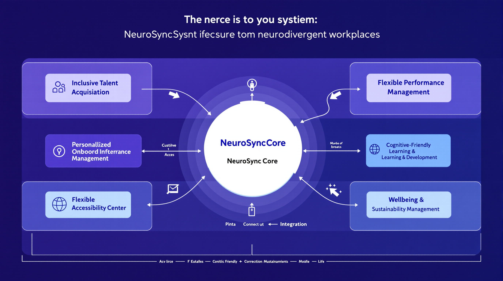

# NeuroSync: A Revolutionary HR System for Neurodivergent Workplaces

## Executive Summary

NeuroSync is a pioneering HR automation system specifically designed to create, support, and enhance neurodivergent-inclusive workplaces. Unlike traditional HR systems that reinforce neurotypical norms, NeuroSync embraces neurodiversity as a competitive advantage and builds flexibility, accommodation, and strength-based approaches directly into its architecture.

This system bridges the gap between traditional HR operations and the needs of neurodivergent employees (including those with ADHD, autism, dyslexia, and other cognitive differences), while simultaneously improving the experience for all employees through more humane, flexible, and personalized approaches to workplace management.

## Core Philosophy & Design Principles

### 1. Strengths-Based Architecture
NeuroSync is built on the fundamental principle that neurodivergent minds represent valuable cognitive diversity rather than deficits to be accommodated. The system actively identifies and leverages unique strengths and thinking styles.

### 2. Flexible Process Design
Rather than forcing employees to conform to rigid processes, NeuroSync provides multiple pathways to accomplish the same HR objectives, accommodating different cognitive styles and preferences.

### 3. Reduced Cognitive Friction
Every interaction is designed to minimize unnecessary cognitive load, reduce executive function demands, and eliminate friction points that disproportionately affect neurodivergent employees.

### 4. Universal Design Approach
While specifically addressing neurodivergent needs, NeuroSync implements universal design principles that improve the experience for all employees regardless of neurotype.

### 5. Privacy-First Accommodation
The system manages accommodations and adjustments with strong privacy protections, giving employees control over what information is shared with whom.

### 6. Data-Driven Personalization
NeuroSync uses AI to learn individual preferences, challenges, and optimal working patterns to provide increasingly personalized experiences over time.

## System Architecture Overview

NeuroSync is built on a modular microservices architecture that allows for:
- Flexible component integration
- Personalization at the individual level
- Continuous evolution and improvement
- Enterprise-grade security and privacy

The system comprises six integrated modules that cover the entire employee lifecycle through a neurodiversity-affirming lens.

## Module 1: Inclusive Talent Acquisition

### Key Features

#### 1. Bias-Mitigating AI Recruitment
- **Neurodiversity-Trained Language AI**: Reviews job descriptions and recruiting materials to identify and remove language that may inadvertently filter out neurodivergent candidates
- **Alternative Assessment Pathways**: Provides candidates multiple ways to demonstrate capabilities beyond traditional interviews
- **Structured Interview Generation**: Creates customized, competency-based interview frameworks that reduce reliance on social performance and arbitrary evaluation

#### 2. Customizable Application Experience
- **Modality Flexibility**: Allows candidates to choose their preferred communication and application methods (written, verbal, visual, or demonstration-based)
- **Accommodation Preference Center**: Offers candidates the ability to specify interview and assessment accommodations without disclosing specific diagnoses
- **Process Transparency**: Provides clear, explicit information about each step in the hiring process with expected timeframes and preparation guidance

#### 3. Strength-Based Candidate Matching
- **Cognitive Diversity Mapping**: Matches role requirements with different cognitive styles that might excel in the position
- **Team Complementarity Analysis**: Identifies how a candidate's thinking style would complement the existing team's cognitive profile
- **Hyperfocus Alignment**: Identifies alignment between a candidate's areas of deep interest and job responsibilities

### Technical Implementation

The Inclusive Talent Acquisition module utilizes:
- Natural Language Processing for bias detection and job description optimization
- Customizable assessment workflow engine
- Secure candidate preference management system
- Integration with major ATS platforms
- Machine learning algorithms for strength-based matching
- Privacy-preserving candidate data management

### Process Flow

1. **Job Analysis**: AI-assisted role analysis identifies the true core requirements vs. preferences and suggested accommodations
2. **Multi-Channel Sourcing**: Strategic outreach to neurodivergent talent pools and general sources with inclusive messaging
3. **Adaptable Application**: Candidates choose their preferred application format and accommodation needs
4. **Customized Assessment**: Skills are evaluated through the candidate's strongest modalities
5. **Structured Interviews**: Consistent, clear evaluation focused on capabilities rather than social presentation
6. **Onboarding Preparation**: Pre-onboarding accommodation planning and team preparation

## Module 2: Personalized Onboarding Experience

### Key Features

#### 1. Adaptive Onboarding Pathways
- **Personalized Onboarding Sequences**: Creates individualized onboarding journeys based on role, learning style, and accommodation needs
- **Information Chunking**: Breaks onboarding information into manageable segments to prevent overwhelm
- **Pacing Control**: Allows employees to progress through onboarding at their optimal pace with appropriate reminders and support

#### 2. Environmental Integration Support
- **Sensory Preference Capture**: Collects information about optimal working environments (lighting, sound, temperature, etc.)
- **Workplace Navigation Tools**: Provides clear visual guides to physical spaces, including quiet areas and sensory considerations
- **Digital Environment Setup**: Assists with configuring digital tools with appropriate accommodations and optimal settings

#### 3. Social Connection Facilitation
- **Structured Introduction Protocols**: Reduces social anxiety through clear frameworks for team introductions
- **Interest-Based Connection**: Facilitates connections with colleagues based on shared interests rather than forced social events
- **Communication Preference Sharing**: Enables employees to easily share their communication preferences with teammates

### Technical Implementation

The Personalized Onboarding Experience module utilizes:
- Adaptive learning system with branching content paths
- Progress tracking with appropriate nudges
- Digital workspace configuration automation
- Accommodation implementation tracking
- Integration with IT provisioning systems
- Team communication preference management

### Process Flow

1. **Pre-boarding Preparation**: Accommodation setup and team preparation before employee arrival
2. **Welcome Experience**: Structured, clear first-day experience with sensory considerations
3. **Personalized Learning Path**: Information delivery tailored to learning style and processing needs
4. **Environmental Optimization**: Physical and digital workspace configuration based on preferences
5. **Graduated Social Integration**: Structured, interest-based team integration at appropriate pace
6. **Check-in and Adjustment**: Regular monitoring with accommodation refinement as needed

## Module 3: Flexible Performance Management

### Key Features

#### 1. Strength-Based Evaluation Framework
- **Personal Strength Profiling**: Identifies and documents individual strengths and optimal working conditions
- **Custom Success Metrics**: Develops personalized KPIs that align with both role requirements and individual work styles
- **Hyperfocus Utilization Tracking**: Captures and credits productive hyperfocus periods rather than penalizing variable attention

#### 2. Multi-Modal Feedback System
- **Communication Style Matching**: Delivers feedback in the employee's preferred communication style and format
- **Visual Progress Tracking**: Provides visual representations of progress and achievements
- **Non-Linear Review Options**: Offers alternatives to traditional linear performance discussions

#### 3. Accommodation Effectiveness Monitoring
- **Dynamic Accommodation Tracking**: Monitors the effectiveness of workplace accommodations over time
- **Environmental Impact Analysis**: Correlates performance patterns with environmental factors and working conditions
- **Adjustment Recommendation Engine**: Suggests potential adjustments based on performance patterns and challenges

### Technical Implementation

The Flexible Performance Management module utilizes:
- Customizable performance metric framework
- Machine learning for pattern recognition in work output
- Integration with project management and productivity tools
- Visualization engine for progress representation
- Secure accommodation effectiveness tracking
- Multi-modal communication delivery system

### Process Flow

1. **Strength Identification**: Collaborative process to identify personal strengths and optimal conditions
2. **Custom Metric Development**: Creation of personalized success metrics aligned with role requirements
3. **Ongoing Capture**: Continuous collection of achievement data through integrated systems
4. **Flexible Check-ins**: Regular feedback delivered through preferred communication channels
5. **Accommodation Refinement**: Data-driven adjustment of workplace accommodations
6. **Strength-Based Growth Planning**: Development planning focused on leveraging core strengths

## Module 4: Cognitive Accessibility Center

### Key Features

#### 1. Workplace Adjustment Management
- **Accommodation Request Workflow**: Streamlined, low-friction process for requesting and implementing accommodations
- **Anonymous Accommodation Library**: Searchable database of successful accommodations by job type (anonymized)
- **Adjustment Implementation Tracking**: Monitors the implementation status of approved accommodations

#### 2. Assistive Technology Integration
- **Technology Recommendation Engine**: Suggests appropriate assistive technologies based on specific needs
- **Setup Automation**: Provides step-by-step guidance for configuring assistive technologies
- **Effectiveness Feedback Loop**: Collects data on technology effectiveness for continuous improvement

#### 3. Environmental Optimization
- **Sensory Profile Management**: Maintains individual sensory preferences and sensitivity profiles
- **Workspace Optimization Guidance**: Provides recommendations for physical and digital workspace configuration
- **Meeting Accessibility Tools**: Ensures meetings are accessible through appropriate accommodations and formats

### Technical Implementation

The Cognitive Accessibility Center utilizes:
- Accommodation workflow engine
- Knowledge base of effective accommodations
- Integration with assistive technology providers
- Environmental sensor data integration (optional)
- Privacy-preserving preference management
- Reporting tools for accommodation ROI

### Process Flow

1. **Need Identification**: Self-service tools for identifying potential helpful accommodations
2. **Streamlined Request**: Low-friction accommodation request process with privacy controls
3. **Rapid Assessment**: Efficient evaluation focused on effectiveness rather than gatekeeping
4. **Implementation Coordination**: Automated coordination across departments for setup
5. **Effectiveness Monitoring**: Data-driven tracking of accommodation impact
6. **Ongoing Optimization**: Continuous refinement based on feedback and changing needs

## Module 5: Cognitive-Friendly Learning & Development

### Key Features

#### 1. Adaptive Learning Pathways
- **Learning Style Assessment**: Identifies individual learning preferences and optimal information processing methods
- **Multi-Modal Content Delivery**: Presents training content in various formats (text, audio, visual, interactive)
- **Personalized Learning Sequences**: Creates custom learning paths based on role, prior knowledge, and cognitive style

#### 2. Focus-Optimized Training Design
- **Attention-Aware Content Chunking**: Breaks training into optimal-sized segments based on cognitive load research
- **Engagement-Optimized Scheduling**: Recommends ideal training times based on individual energy patterns
- **Distraction-Minimized Interfaces**: Presents learning content in clean, focused interfaces with minimal cognitive load

#### 3. Applied Learning Integration
- **Project-Based Skill Application**: Connects learning directly to real work through project-based application
- **Interest-Driven Specialization**: Recommends development paths that align with areas of natural interest
- **Spaced Repetition System**: Implements research-based review scheduling for optimal retention

### Technical Implementation

The Cognitive-Friendly Learning & Development module utilizes:
- Adaptive learning management system
- Multi-format content repository
- Machine learning for optimal scheduling
- Integration with project management systems
- Spaced repetition algorithms
- Progress visualization tools

### Process Flow

1. **Learning Profile Creation**: Assessment of learning preferences and optimal conditions
2. **Personalized Curriculum**: Custom learning path development based on role and cognitive style
3. **Multi-Modal Delivery**: Content delivery in preferred formats and optimal chunks
4. **Integrated Application**: Structured application of learning in real work contexts
5. **Optimized Reinforcement**: Spaced repetition based on forgetting curves
6. **Interest-Driven Extension**: Continuous learning pathways aligned with personal interests

## Module 6: Wellbeing & Sustainability Management

### Key Features

#### 1. Energy Management System
- **Personal Energy Tracking**: Monitors individual energy patterns and optimal working rhythms
- **Cognitive Load Balancing**: Helps manage workload to prevent cognitive overload and burnout
- **Recovery Prompt System**: Provides timely reminders for breaks and recovery based on work patterns

#### 2. Stress Signature Recognition
- **Early Warning System**: Identifies potential burnout indicators through work pattern changes
- **Personalized Intervention Suggestions**: Recommends appropriate interventions based on individual profiles
- **Environmental Trigger Identification**: Helps identify workplace factors that may contribute to stress

#### 3. Work Flexibility Optimization
- **Flexibility Utilization Tracking**: Monitors how effectively flexible work options are being utilized
- **Schedule Optimization Recommendations**: Suggests optimal work schedules based on productivity patterns
- **Boundary Management Tools**: Helps establish and maintain healthy work/life boundaries

### Technical Implementation

The Wellbeing & Sustainability Management module utilizes:
- Optional integration with biometric monitoring (if desired)
- Work pattern analysis algorithms
- Predictive modeling for burnout prevention
- Calendar and scheduling integration
- Privacy-preserving wellbeing analytics
- Personalized intervention recommendation engine

### Process Flow

1. **Pattern Establishment**: Baseline creation of individual energy and productivity patterns
2. **Optimal Scheduling**: Work schedule recommendations based on personal rhythms
3. **Dynamic Monitoring**: Ongoing tracking of work patterns and potential stress indicators
4. **Early Intervention**: Proactive recommendations when patterns suggest potential issues
5. **Environmental Optimization**: Continuous refinement of working conditions
6. **Sustainable Performance**: Long-term maintenance of productive, healthy work patterns

## Integration & Implementation

### System Integration Points

NeuroSync is designed to integrate with:
- Existing HRIS and HCM systems
- Applicant Tracking Systems
- Learning Management Systems
- Productivity and project management tools
- Calendar and email systems
- Workspace management platforms

The system uses standard APIs and webhooks to connect with existing enterprise systems while maintaining appropriate security boundaries.

### Implementation Approach

Implementation follows a phased approach:

1. **Assessment & Strategy**: Evaluation of current state and development of neurodiversity inclusion strategy
2. **Core Platform Setup**: Implementation of central NeuroSync platform and integration framework
3. **Module Prioritization**: Selection of initial modules based on organizational priorities
4. **Pilot Group Deployment**: Controlled implementation with a diverse pilot group
5. **Feedback-Driven Refinement**: System adjustment based on pilot experience
6. **Phased Organization Rollout**: Graduated implementation across departments
7. **Continuous Improvement**: Ongoing optimization based on usage data and feedback

### Change Management Considerations

Successful implementation requires:
- Leadership education on neurodiversity as competitive advantage
- Manager training on strength-based approaches
- Clear communication about privacy protections
- Visible executive sponsorship and participation
- Involvement of neurodivergent employees in implementation
- Measurement of impact and business outcomes
- Celebration of successful neurodiversity inclusion

## Data Privacy & Ethical Considerations

### Privacy Architecture

NeuroSync implements Privacy by Design principles:
- Employee control over personal neurodiversity information
- Granular permission settings for data sharing
- Anonymized aggregation for organizational insights
- Strict access controls based on role and need
- Regular privacy impact assessments
- Compliance with all relevant data protection regulations

### Ethical AI Framework

The system's AI components follow strict ethical guidelines:
- Transparency in how algorithms make recommendations
- Regular bias detection and mitigation
- Human oversight of all automated decisions
- Ongoing testing for unintended consequences
- Diverse training data representing different neurotypes
- Continuous improvement based on ethical reviews

## Business Impact & ROI

Organizations implementing NeuroSync can expect:

### Talent Advantages
- Access to previously untapped neurodivergent talent pools
- Improved hiring success for technical and specialized roles
- Increased retention of valuable neurodivergent employees
- Enhanced team cognitive diversity driving innovation

### Productivity Gains
- Better alignment of tasks with cognitive strengths
- Reduced productivity loss from environmental barriers
- More effective utilization of hyperfocus and specialized abilities
- Decreased time lost to miscommunication and confusion

### Cultural Benefits
- More inclusive, psychologically safe workplace culture
- Reduced stigma around different working and thinking styles
- Increased employee engagement across all neurotypes
- Enhanced reputation as an inclusive employer

### Compliance & Risk Reduction
- Improved reasonable accommodation processes
- Better documentation of inclusion efforts
- Reduced risk of discrimination claims
- Stronger demonstration of diversity commitment

## Success Measurement Framework

The impact of NeuroSync is measured through:

### Quantitative Metrics
- Recruitment pipeline diversity metrics
- Retention rates across different neurotypes
- Accommodation implementation time and effectiveness
- Performance distribution across neurotypes
- Employee engagement and wellbeing scores

### Qualitative Assessments
- Employee experience interviews and feedback
- Manager capability in supporting neurodivergent team members
- Inclusion sentiment across the organization
- Team effectiveness and collaboration quality
- Innovation output and quality

### Continuous Improvement Mechanisms
- Regular system usage analysis
- User experience feedback collection
- Accommodation effectiveness reviews
- Ongoing neurodiversity inclusion maturity assessment
- External benchmark comparisons

## Conclusion: The Neurodiversity Advantage

NeuroSync represents a fundamental shift from treating neurodiversity as a compliance issue to leveraging it as a competitive advantage. By designing HR systems that work with rather than against different cognitive styles, organizations can unlock the full potential of their entire workforce.

In today's complex, rapidly changing business environment, cognitive diversity is not just a nice-to-have—it's a strategic necessity. Teams with diverse thinking styles demonstrate greater innovation, more effective problem-solving, and better decision-making.

NeuroSync provides the technological foundation for this transformation, creating workplaces where neurodivergent employees can thrive while enhancing outcomes for the entire organization.